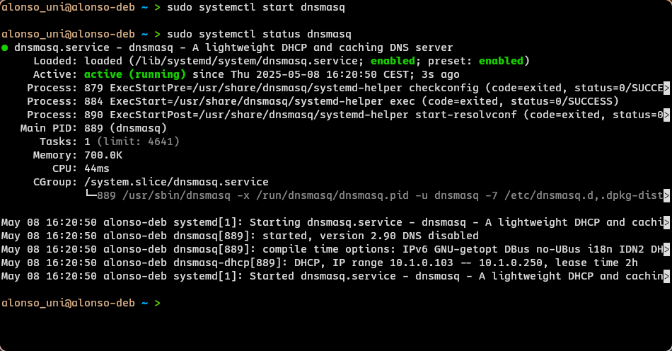

## Administración de Redes Linux <!-- omit in toc -->

# Entregable 7: PXE

<!-- markdownlint-disable MD053 -->
[![CC BY-SA 4.0][shield-cc-by-sa]][cc-by-sa]
[![GITT][shield-gitt]][gitt]
[![Administración de Redes Linux][shield-lna]][lna]

* [Introducción](#introducción)
* [1. Configuración de un servidor para instalar Debian con configuración cero](#1-configuración-de-un-servidor-para-instalar-debian-con-configuración-cero)
    * [1.1. Añadir interfaces en red interna](#11-añadir-interfaces-en-red-interna)
    * [1.2. Configuración estática de la nueva interfaz](#12-configuración-estática-de-la-nueva-interfaz)
    * [1.3. Servidor DHCP](#13-servidor-dhcp)
    * [1.4. Configuración de router](#14-configuración-de-router)
    * [1.5. TFTP](#15-tftp)
    * [1.6. Configuración de PXE](#16-configuración-de-pxe)

---

## Introducción

Este documento contiene el registro del desarrollo de la actividad, incluyendo
las instrucciones principales, las decisiones, y los resultados.

> **Nota:** El desarrollo de esta actividad se ha realizado en una máquina
> virtual con Debian 12. Puede haber diferencias en otras distribuciones.

## 1. Configuración de un servidor para instalar Debian con configuración cero

### 1.1. Añadir interfaces en red interna

Para este paso, al tratarse de una máquina virtual QEMU administrada desde
`virt-manager`, los pasos son distintos a los de una máquina administrada con
VirtualBox.

#### Creación de la red interna

El primer paso será crear una red interna, de nombre `virbr1` por ejemplo. Se
puede hacer usando `sudo virsh net-create --file <filename>`, donde
`<filename>` es el nombre de un archivo de configuración de red en XML. El
siguiente es un ejemplo de un archivo que crea esta red `virbr1`:

```xml
<network>
  <name>virbr1</name>
  <bridge name='virbr1' stp='on' delay='0'/>
</network>
```

#### Asignación de la red interna a la máquina virtual

Una vez creada la red interna, se puede asignar a la máquina virtual. Lo más
sencillo es hacerlo desde la interfaz gráfica de `virt-manager`. Desde el menú
'Details' de la máquina virtual, haciendo click en 'Add Hardware':


En el menú emergente, seleccionamos 'Network' en el panel izquierdo y el nombre
de nuestra nueva red interna (`virbr1`) en el desplegable de 'Network source':


En la opción 'Device model' podemos seleccionar 'Hypervisor default' o la
opción que se ajuste a nuestras necesidades. Para finalizar, hacemos click en
'Finish' para guardar los cambios.

> **Nota:** dado que no hemos configurado un servidor DHCP interno ni un
> router, la máquina no obtendrá una dirección IP automáticamente, ni podría
> acceder a Internet si su única interfaz estuviera conectada a esta red.

#### Creación de la Máquina Virtual cliente

Vamos a crear una máquina virtual nueva con las siguientes características:

* Nombre: linuxpxe
* Tipo: Linux
* Versión: Other Linux (64-bits)
* Tamaño de memoria: 1 GB
* Tamaño de almacenamiento: 8 GB
* Interfaz de red: `virbr1`

La forma más sencilla es a través de la interfaz gráfica de `virt-manager`.
Desde la pantalla principal, haciendo click en 'Create a new virtual machine',
avanzaremos por el asistente de creación de máquinas virtuales eligiendo las
opciones anteriores.


El menú 'Network selection' del último paso está oculto por defecto. Para
seleccionar una red diferente a la predeterminada, debemos hacer click en el
texto 'Network selection' para revelar la opción y seleccionar la red interna
en el desplegable.

### 1.2. Configuración estática de la nueva interfaz

Lo primero que haremos será decidir las IPs que tomarán las máquinas virtuales.
El rango `10.0.0.0/8` es un rango privado que podemos usar, y en este caso
usaremos la subred `10.1.0.0/24` para la red interna:

* `10.1.0.3/24` para el servidor PXE
* IP del rango `10.1.0.103` al `10.1.0.250` para los clientes PXE (DHCP)

#### Configuración de la IP estática en el servidor

Para configurar la IP estática en el servidor, primero debemos obtener el
nombre de la interfaz de red que virt-manager ha asignado a la máquina virtual.
Por ejemplo, se puede obtener con `ip a`:

<!-- markdownlint-capture -->
<!-- markdownlint-disable MD013 -->
```text
$ ip a
1: lo: <LOOPBACK,UP,LOWER_UP> mtu 65536 qdisc noqueue state UNKNOWN group default qlen 1000
    link/loopback 00:00:00:00:00:00 brd 00:00:00:00:00:00
    inet 127.0.0.1/8 scope host lo
       valid_lft forever preferred_lft forever
    inet6 ::1/128 scope host noprefixroute
       valid_lft forever preferred_lft forever
2: enp2s0: <BROADCAST,MULTICAST,UP,LOWER_UP> mtu 1500 qdisc fq_codel state UP group default qlen 1000
    link/ether 52:54:00:c3:94:00 brd ff:ff:ff:ff:ff:ff
    inet 192.168.122.106/24 brd 192.168.122.255 scope global dynamic enp2s0
       valid_lft 3294sec preferred_lft 3294sec
    inet6 fe80::5054:ff:fec3:9400/64 scope link
       valid_lft forever preferred_lft forever
4: enp10s0: <BROADCAST,MULTICAST,UP,LOWER_UP> mtu 1500 qdisc fq_codel state UP group default qlen 1000
    link/ether 52:54:00:95:46:10 brd ff:ff:ff:ff:ff:ff
    inet6 fe80::5054:ff:fe95:4610/64 scope link
       valid_lft forever preferred_lft forever
```
<!-- markdownlint-restore -->

La segunda interfaz (`enp2s0`) tiene una IP asignada, por lo que no puede ser
la que acabamos de crear, sino que está conectada a la red por defecto. La
interfaz conectada a la red interna en este caso es `enp10s0`.

La configuración de la interfaz está en `/etc/network/interfaces`. Virt-manager
ha creado automáticamente una entrada de configuración para esta interfaz:

```text
auto enp10s0
iface enp0s10 inet dhcp
```

Para configurar la IP estática, editamos el archivo `/etc/network/interfaces`
y cambiamos la configuración de la interfaz `enp10s0` a:

```text
auto enp10s0
iface enp10s0 inet static
    address 10.1.0.3/24
```

En este ejercicio, el contenido completo de `/etc/network/interfaces` es el
siguiente:


> **Info:** La línea `auto enp10s0` indica que la interfaz se debe activar
> automáticamente.  Si la omitimos, tendremos que activar la interfaz
> manualmente (e.g. `sudo ifup enp10s0`).

### 1.3. Servidor DHCP

Aunque `isc-dhcp-server` es una opción popular, ya no tiene mantenimiento
activo. Para este ejercicio se usará `dnsmasq`, un servidor DHCP y DNS muy
ligero que además incluye un servidor TFTP (solo lectura). La página de
[dnsmasq en la Wiki de Arch](https://wiki.archlinux.org/title/Dnsmasq) contiene
información útil sobre la instalación y el uso como servidor DHCP, DNS, TFTP y
PXE.

Para instalarlo en Debian, ejecutamos:

```bash
sudo apt install dnsmasq
```


#### Configuración de dnsmasq

El archivo de configuración de `dnsmasq` se encuentra en `/etc/dnsmasq.conf`.
Se pueden configurar los servicios de DHCP, DNS y TFTP. Para este apartado,
solo se habilitará el servicio DHCP. Se establecerá un rango de direcciones IP
de 10.1.0.103 a 10.1.0.250, anunciando la IP del servidor como *gateway* y un
servidor DNS público (8.8.8.8):

```ini
port = 0 # Deshabilitar el servidor DNS

interface = enp10s0              # Interfaz para DHCP (red interna)
dhcp-range = 10.1.0.103,10.1.0.250,255.255.255.0,2h
dhcp-option = 3,10.1.0.3         # Gateway: IP del router (servidor PXE)
dhcp-option = 6,8.8.8.8          # Servidor DNS público
dhcp-option = 28,10.1.0.255      # Dirección de broadcast

# Enable logging
log-dhcp
log-queries
```

Con esta configuración, podemos iniciar el servidor usando la unidad de
`systemd`:

```bash
sudo systemctl start dnsmasq
```

La siguiente captura de pantalla muestra la ejecución del comando y el estado
del servicio tras iniciar:



Para comprobar el funcionamiento del servidor DHCP, iniciaremos la máquina
`linuxpxe` indicando que arranque por red mientras capturamos el tráfico de red
en el servidor con `tcpdump`.

#### Captura de tráfico

Primero iniciaremos una captura con `tcpdump` en el servidor, filtrando por la
interfaz `enp8s0`. En caso de no tenerlo instalado, se puede instalar con:

```bash
sudo apt install tcpdump
```

Para iniciar la captura y guardarla en un archivo, ejecutamos:

```bash
sudo tcpdump -i enp10s0 -w captures/1.3-dchp-test.pcap --print -lvv
```

Para más información, consultar `tcpdump(1)`.

#### Prueba DHCP con la máquina cliente

Al crear la máquina con Virt-Manager, el menú de arranque está deshabilitado
por defecto. Desde la interfaz gráfica, en la vista de 'Details', en la sección
'Boot Options' podemos habilitar el menú de arranque y, en la lista, incluir la
tarjeta de red correspondiente. También podemos seleccionar el arranque por red
como primera opción subiéndolo en la lista, e incluso dejarlo como única opción
y deshabilitar el menú de arranque.

La siguiente captura muestra la configuración con el menú de arranque
habilitado y la tarjeta de red como primera opción:


A continuación, arrancaremos la máquina cliente para comprobar que el servidor
DHCP está funcionando correctamente. Al haber elegido el arranque por red como
primera opción, no es necesario entrar al menú de arranque. La siguiente
captura muestra el resultado:


> **Nota:** Algunas opciones de vídeo pueden no funcionar correctamente en
> esta situación, como Virtio con display Spice. En este ejemplo se ha usado
> QXL.

#### Resultados de la captura

La captura de tráfico de red se guardó en el archivo
[`captures/1.3-dchp-test.pcap`](`captures/1.3-dchp-test.pcap`), y se se puede
leer de nuevo usando `tcpdump`:

```bash
tcpdump -r captures/1.3-dchp-test.pcap -vv
```

A continuación se muestra una captura de pantalla con un extracto de la salida:


### 1.4. Configuración de router

En el apartado anterior, configuramos el servidor DHCP para que se anunciara a
sí mismo como *gateway*. En este apartado, lo configuraremos para que actúe
como tal.

#### Configuración de reenvío de paquetes

Para que redirija el tráfico entre redes de distintas interfaces (e.g. entre la
red interna y la externa), debemos habilitar el reenvío de paquetes modificando
el archivo `/etc/sysctl.conf`: debemos descomentar o añadir la siguiente línea:

```text
net.ipv4.ip_forward = 1
```

Y, para aplicar los cambios, ejecutamos:

```bash
sudo sysctl -p
```

#### Configuración de NAT

Debido a que la red interna usa un rango privado, hay que configurar NAT para
permitir la salida a Internet <span style="font-size: 0.8em;">(o, en este caso,
a la red 'externa', que suele ser una red interna del *host* con su propia
configuración DHCP y NAT hacia el mundo exterior, <span style="font-size:
0.8em;">que a su vez podría ser una red interna de una casa o empresa con su
propio router con DHCP y NAT, <span style="font-size: 0.8em;">que a su vez
podría ser una red interna de un proveedor de Internet usando
CGNAT...)</span></span></span>

Esta configuración se hará con `nftables`. En Debian 12, viene pre-instalado,
y se puede habilitar e iniciar con `systemctl`:

```bash
sudo systemctl enable --now nftables
```

En Debian, la configuración que usa la unidad de `systemd` se puede modificar
en el fichero `/etc/nftables.conf`. También se puede modificar por línea de
comandos, dado que el *daemon* esté ejecutándose.

```bash
sudo nft add table ip nat
sudo nft add chain ip nat postrouting \
   '{ type nat hook postrouting priority srcnat; }'
sudo nft add rule ip nat postrouting oifname "enp2s0" masquerade

sudo nft add table ip filter
sudo nft add chain ip filter forward \
   '{ type filter hook forward priority filter; }'
sudo nft add rule ip filter forward iifname "enp2s0" oifname "enp2s0" \
   ct state '{ related, established }' accept
sudo nft add rule ip filter forward iifname "enp10s0" oifname "enp10s0" accept
```

El primer bloque de reglas configura las reglas de NAT, especificando que, tras
decidir el siguiente paso de un paquete, si el tráfico sale por la interfaz
`enp2s0`, se aplicará el enmascaramiento, es decir, se cambiará la IP de origen
por la IP de la interfaz `enp0s3`.

El segundo bloque de reglas configura el *firewall*: permite todo el tráfico
saliente de la interfaz `enp10s0` a la interfaz `enp2s0`, y el tráfico de
respuesta desde `enp2s0` a `enp10s0` (solo si la conexión está establecida).

Se puede comprobar la configuración de `nftables` ejecutando:

```bash
sudo nft list ruleset
```

La siguiente captura muestra la salida de este comando:


### 1.5. TFTP

Ya que estamos usando `dnsmasq`, no necesitamos un servidor TFTP por separado,
pero sí tendremos que obtener un instalador para enviar al cliente. En este
caso, usaremos un Debian 12, que podemos adquirir con el paquete
`debian-installer-12-netboot-amd64`:

```bash
sudo apt install debian-installer-12-netboot-amd64
```

Para habilitar el servidor TFTP integrado de `dnsmasq`, añadimos las siguientes
líneas al archivo de configuración `/etc/dnsmasq.conf`:

```ini
enable-tftp
tftp-root = /srv/tftp
dhcp-boot = pxelinux.0
```

Es necesario crear el directorio `/srv/tftp`.

```bash
sudo mkdir -p /srv/tftp
```

> **Nota:** Podemos incluir en una nueva línea la opción `tftp-secure`, que
> obliga a que el directorio y todos los archivos servidos sean propiedad del
> usuario `dnsmasq`. En ese caso, debemos actualizar el propietario (e.g. con
> `chown`).

#### Comprobar el funcionamiento del servidor TFTP

Para comprobar que el servidor TFTP está funcionando, podemos usar el cliente
TFTP `tftp-hpa`, que se puede instalar con:

```bash
sudo apt install tftp-hpa
```

Primero crearemos un archivo de prueba en el servidor, por ejemplo
`/srv/tftp/test`, recordando que debe ser propiedad de `dnsmasq`.  Podemos
editarlo con un editor de texto o introducir texto directamente:

```bash
echo 'Hello World!' | sudo tee /srv/tftp/test
```

A continuación, desde un cliente (en la misma máquina u otra máquina con el
cliente `tftp-hpa` instalado), podemos probar a descargar el archivo:

```bash
tftp 10.1.0.3 -c get test
```

La siguiente captura muestra el funcionamiento visto desde el cliente TFTP:


### 1.6. Configuración de PXE

Para presentar la imagen de Debian al cliente, podríamos convertir el
directorio TFTP en un enlace simbólico (solo si no estamos usando la opción
`tftp-secure`) para que `/srv/tftp` apunte directamente a
`/usr/lib/debian-installer/images/12/amd64/text`, directorio en el que se
encuentran los archivos necesarios para el arranque por red (incluído
`pxelinux.0`):

```bash
sudo rm -rf /srv/tftp
sudo ln -s /usr/lib/debian-installer/images/12/amd64/text /srv/tftp
```

En la siguiente captura se puede ver el resultado, donde `/srv/tftp` es un
enlace simbólico a `/usr/lib/debian-installer/images/12/amd64/text`, además
de los archivos que contiene:


No es necesario reiniciar el servidor, los archivos se encontrarán cuando se
requieran.

#### Comprobar el funcionamiento de PXE

Podemos probar a iniciar la máquina cliente `linuxpxe` de nuevo. Si todo ha ido
bien, debería arrancar desde la red y mostrarnos el menú de instalación de
Debian:


[shield-cc-by-sa]: https://img.shields.io/badge/License-CC%20BY--SA%204.0-lightgrey.svg
[shield-gitt]:     https://img.shields.io/badge/Degree-Telecommunication_Technologies_Engineering_|_UC3M-eee
[shield-lna]:       https://img.shields.io/badge/Course-Linux_Networks_Administration-eee

[cc-by-sa]: https://creativecommons.org/licenses/by-sa/4.0/
[gitt]:     https://uc3m.es/bachelor-degree/telecommunication
[lna]:       https://aplicaciones.uc3m.es/cpa/generaFicha?est=252&plan=445&asig=18467&idioma=2
